# 🎬 Tufti Navigator - System Overview

> *"I am not a coach. I am a director. You are not a student. You are a creator."*
> — Tufti the Priestess

## What is Tufti Navigator?

Tufti Navigator is an AI-powered Reality Transurfing companion that brings **Tufti the Priestess** to life — the theatrical, wise, and intimate guide from Vadim Zeland's Transurfing teachings. She helps users navigate reality through the lens of Transurfing philosophy: managing intention, reducing importance, and directing their own reality film.

---

## 🏗️ System Architecture

```mermaid
flowchart TB
    subgraph Frontend["🖥️ Frontend (React + Vite)"]
        UI[Chat Interface]
        Voice[Voice Input/Output]
        Images[Image Upload]
        Thinking[Thinking Indicator]
    end

    subgraph Backend["⚙️ Backend (Node.js)"]
        Server[Express Server]
        RAG[Elite RAG v3.0]
        MultiAgent[Multi-Agent Chain]
        SlideGen[Target Slide Generator]
    end

    subgraph AI["🧠 AI Services"]
        Claude[Claude Opus 4.5]
        Flux[FLUX.2-pro]
        Azure[Azure OpenAI]
    end

    subgraph Knowledge["📚 Knowledge Base"]
        Pinecone[(Pinecone Vector DB)]
        Books[4 Transurfing Books]
    end

    subgraph Storage["💾 Storage"]
        Supabase[(Supabase)]
    end

    UI --> Server
    Voice --> Server
    Images --> Server
    Server --> RAG
    Server --> MultiAgent
    Server --> SlideGen
    RAG --> Pinecone
    RAG --> Azure
    MultiAgent --> Claude
    SlideGen --> Flux
    Server --> Supabase
    Thinking --> UI
```



---

## 🎭 Core Capabilities

### 1. **Conversational Guidance**
Tufti provides personalized Reality Transurfing guidance through natural conversation.


**Features:**
- 🎬 Theatrical, intimate persona
- 📖 Grounded in 4 Transurfing books
- 🌍 Darija/French/English support
- ⏰ Temporal awareness (knows time of day)
- 👤 User profile personalization

---

### 2. **Extended Thinking (Vision Crystallized)**

Tufti uses Claude's extended thinking for deep, multi-layered responses.


**Thinking Budget:** Up to 32,000 tokens for complex reasoning

---

### 3. **Multi-Agent Oracle Mode**

For complex questions, Tufti activates a research chain with specialized agents.


---

### 4. **Elite RAG v3.0 (Knowledge Retrieval)**

Retrieves relevant passages from the Transurfing library.


---

### 5. **Image Analysis**

Tufti can see and analyze images shared by users.

```mermaid
flowchart LR
    subgraph Upload
        I[📷 Image] --> Convert[Base64 Encode]
    end
    
    subgraph Processing
        Convert --> Claude[Claude Vision]
        Claude --> Analysis[Visual Analysis]
    end
    
    subgraph Response
        Analysis --> Tufti[Tufti's Interpretation]
        Tufti --> R[Response with<br/>Transurfing lens]
    end
```



---

### 6. **Target Slide Visualizer** *(NEW)*

Generate photorealistic images of desired realities using FLUX.2-pro.

```mermaid
flowchart TD
    subgraph Detection
        User[User describes vision] --> Tufti
        Tufti --> Tag["[COMPOSE_SLIDE: description]"]
    end
    
    subgraph Generation
        Tag --> Button["✨ Compose This Scene"]
        Button --> API[/api/slide/generate]
        API --> FLUX[FLUX.2-pro]
        FLUX --> Image[Photorealistic Image]
    end
    
    subgraph Display
        Image --> UI[Display in Chat]
        UI --> Save[Save as Target Slide]
    end
    
    style Button fill:#d69e2e,stroke:#f6e05e
    style FLUX fill:#2b6cb0,stroke:#63b3ed
```

---

### 7. **Voice Interface**

Full voice input and output capabilities.

```mermaid
flowchart LR
    subgraph Input
        Mic[🎤 Microphone] --> STT[Speech-to-Text<br/>Web Speech API]
    end
    
    subgraph Processing
        STT --> Tufti[Tufti Processing]
    end
    
    subgraph Output
        Tufti --> TTS[Text-to-Speech<br/>Azure Neural Voice]
        TTS --> Speaker[🔊 Audio Playback]
    end
```



---

## 🗂️ Data Flow


---

## 📊 Technical Specifications

| Component | Technology | Purpose |
|-----------|------------|---------|
| Frontend | React 18 + Vite | Modern SPA framework |
| Styling | Tailwind CSS | Utility-first styling |
| Backend | Node.js + Express | API server |
| AI Model | Claude Opus 4.5 | Conversational AI |
| Image Gen | FLUX.2-pro | Target Slide generation |
| Embeddings | Azure text-embedding-3-large | Semantic search |
| Vector DB | Pinecone | Knowledge retrieval |
| Database | Supabase | User data, conversations |
| Auth | Supabase Auth | Google OAuth, email |
| Voice TTS | Azure Neural Voice | Text-to-speech |
| Voice STT | Web Speech API | Speech-to-text |

---

## 🎯 User Journey


---

## 🔮 Future Capabilities

- [ ] **Journey Tracking** - Long-term progress visualization
- [ ] **Pendulum Detection** - Identify energy-draining patterns
- [ ] **Intention Tools** - Goal setting with Transurfing principles
- [ ] **Community Features** - Share insights with other practitioners
- [ ] **Mobile App** - Native iOS/Android experience

---

## 💚 Philosophy

Tufti Navigator isn't just an AI assistant — she's a **mirror for self-reflection**, a **guide through the alternatives space**, and a **reminder that you are the Director of your own reality film**.

> *"Wake up, Director. The film is rolling. What scene shall we create today?"*

---

*Built with intention by the Night Architect* 🌙
